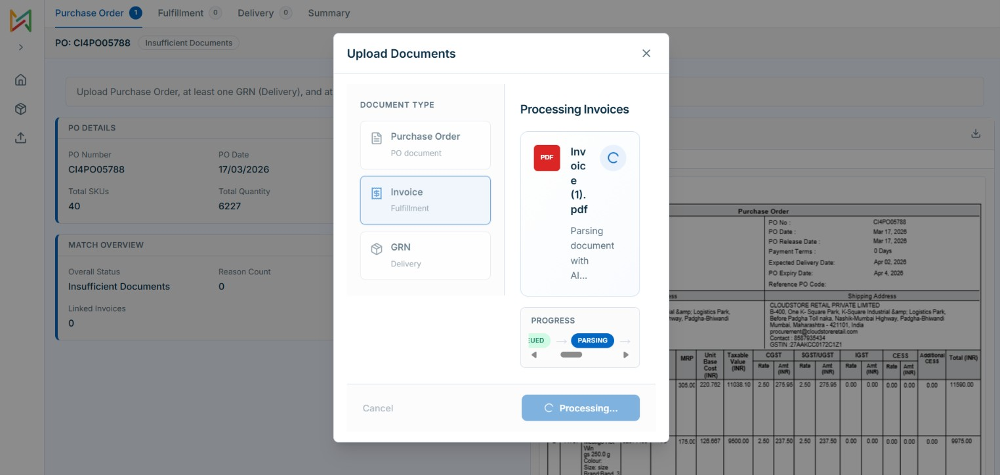
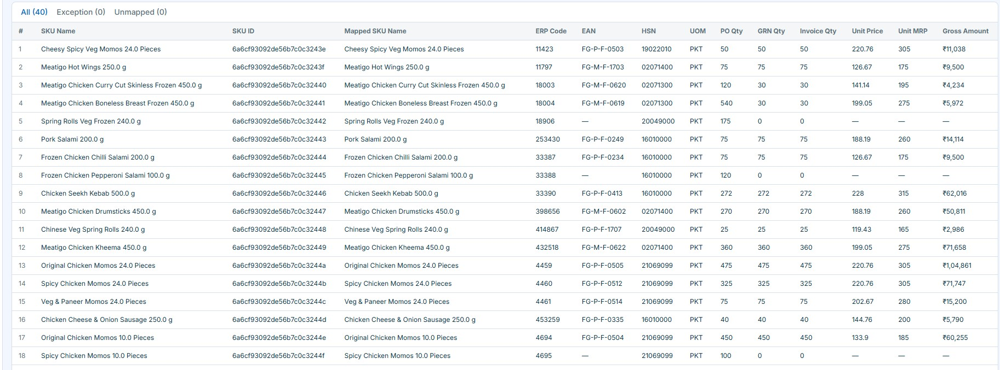
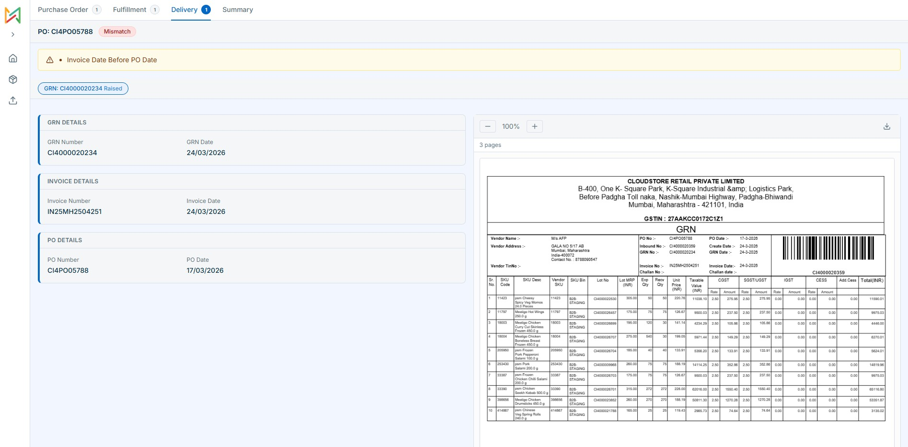
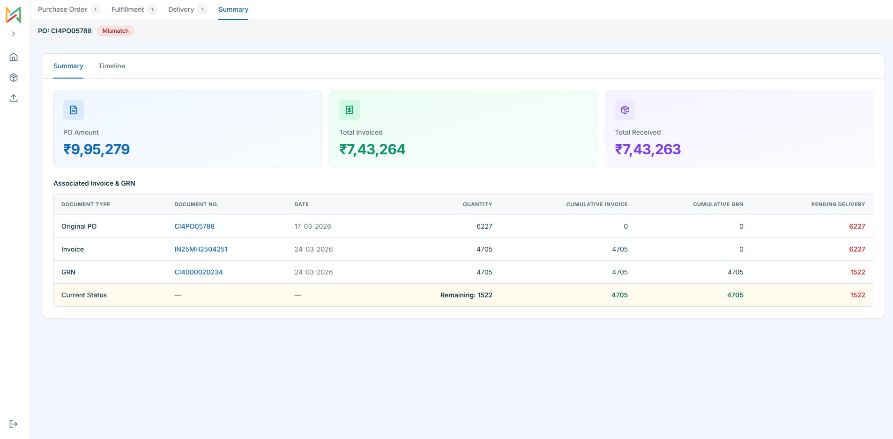
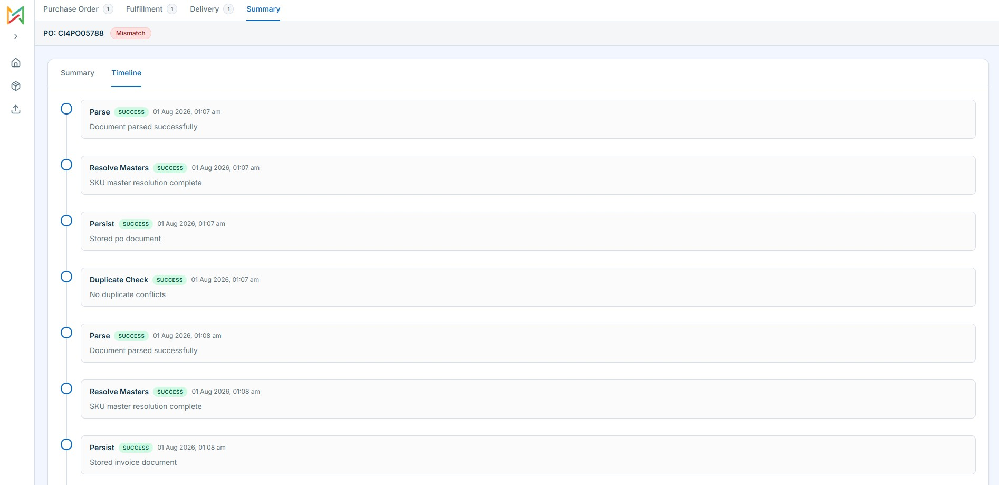
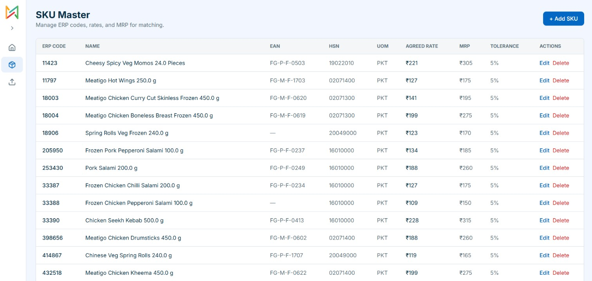

# Three-Way Match Engine

Full-stack procurement reconciliation — upload PO, GRN, and Invoice PDFs, extract data with Gemini, resolve against SKU Master, and run item-level three-way matching with a UI to review results alongside the original files.

---

## What It Does

Three documents describe the same purchase:

- **PO** — what was ordered
- **GRN** — what the warehouse received
- **Invoice** — what the vendor is billing

The app checks they agree before payment. Upload in any order — an Invoice before the PO exists gets stored and shows `insufficient_documents` until the rest arrive.

---

## Tech Stack

| Layer | Stack |
|---|---|
| Backend | Node.js, Express, MongoDB (Mongoose) |
| Frontend | Next.js 14, TypeScript, Tailwind CSS |
| State | TanStack Query v5 |
| Parsing | Google Gemini API (`gemini-3.5-flash-lite`) |
| Uploads | Multer + Cloudinary |
| Auth | Mock Bearer token |

---

## Setup

**Prerequisites:** Node.js 20+, MongoDB, Gemini API key

```bash
# Backend (port 5000)
cd backend
cp .env.example .env   # set MONGODB_URI, GEMINI_API_KEY, AUTH_TOKEN, CLOUDINARY_*
npm install && npm run dev

# Frontend (port 3000)
cd frontend
npm install && npm run dev
```

Or from root: `npm run install:all`, then `npm run dev:backend` and `npm run dev:frontend` in separate terminals.

Swagger UI: `http://localhost:5000/api-docs`

---

## Screenshots

**Upload & parsing** — live progress through Gemini extraction and master resolution.



**Item grid** — PO, GRN, and Invoice quantities per SKU with All / Exception / Unmapped tabs.



**Delivery tab** — extracted GRN data with PDF preview and mismatch banners.



**Summary** — stat cards and cumulative invoice/GRN table with pending quantities.



**Process timeline** — audit log of each upload pipeline step.



**SKU Master** — ERP codes, agreed rates, MRP, and price tolerance.



---

## How It Works

**Upload pipeline:** file → Gemini parse (one retry on failure) → SKU Master lookup → persist → duplicate check → audit log. Malformed docs are never saved.

**Collections:** `SkuMaster`, `PurchaseOrder`, `Grn`, `Invoice`, `MatchAudit`. Each document stores untouched `rawParsed` from Gemini.

**Matching key:** resolved `SkuMaster._id`, falling back to normalised `itemCode`. Descriptions vary across documents; ERP codes don't.

**Master lookup:** `skuErpCode` → `eanCode` → null (soft warning). Re-resolved on every `GET /match` and `GET /summary` — create a SKU after upload and the next read picks it up.

**Match engine** (`computeMatch()` in `backend/src/services/matchEngine.service.js`): always recomputed, never cached. Sums quantities per SKU across multiple GRNs/Invoices. Earliest PO wins on duplicates. Re-uploading the same invoice number is accepted and stored, but only the earliest copy is counted in match and summary.

**Out-of-order:** documents link by `poNumber` string, not a PO foreign key.

---

## API

All routes except `/health` and `/auth/login` require `Authorization: Bearer <token>`.

| Method | Endpoint | Description |
|---|---|---|
| `POST` | `/auth/login` | Get Bearer token |
| `POST` | `/documents/upload` | Upload PDF/image (202 + job poll; result includes `matchStatus`) |
| `GET` | `/documents/upload/jobs/:jobId` | Poll upload status |
| `GET` | `/documents` | List documents |
| `GET` | `/match/:poNumber` | Item-level match result |
| `GET` | `/summary/:poNumber` | Summary stats + cumulative table |
| `GET/POST/PATCH/DELETE` | `/masters/sku` | SKU Master CRUD |

```bash
# Upload
curl -X POST http://localhost:5000/documents/upload \
  -H "Authorization: Bearer TOKEN" \
  -F "file=@PO.pdf" -F "documentType=po"

# Match
curl http://localhost:5000/match/CI4PO05788 \
  -H "Authorization: Bearer TOKEN"
```

---

## Match Status & Reasons

| Status | When |
|---|---|
| `insufficient_documents` | Missing PO, GRN, or Invoice |
| `mismatch` | Hard rule violation |
| `partially_matched` | Soft warnings or qty not fully reconciled |
| `matched` | Clean |

| Code | Severity |
|---|---|
| `grn_qty_exceeds_po_qty` | Hard |
| `invoice_qty_exceeds_grn_qty` | Hard |
| `invoice_qty_exceeds_po_qty` | Hard |
| `invoice_date_after_po_date` | Hard |
| `duplicate_po` / `duplicate_document` | Hard |
| `item_missing_in_po` | Hard |
| `price_mismatch` / `mrp_mismatch` / `unmapped_master_sku` | Soft |

---

## Frontend Routes

| Route | Purpose |
|---|---|
| `/login` | Auth |
| `/dashboard` | PO list + upload |
| `/masters` | SKU Master CRUD |
| `/match/[poNumber]` | PO tab |
| `/match/[poNumber]/fulfillment?doc=` | Invoice tab |
| `/match/[poNumber]/delivery?doc=` | GRN tab |
| `/match/[poNumber]/summary` | Summary + timeline |

TanStack Query handles all server state. Upload modal polls the backend job with live step labels.

---

## Production

### Vercel (frontend + backend, recommended)

The repo root `vercel.json` deploys both services from one project:

| Service | Root | URL |
|---|---|---|
| Frontend (Next.js) | `frontend` | `https://your-app.vercel.app` |
| Backend (Express) | `backend` | `https://your-app.vercel.app/api/backend` |

1. Import the GitHub repo on [vercel.com](https://vercel.com)
2. Use **Application Preset: Services** (auto-detected from `vercel.json`)
3. Add env vars to the **backend** service:

```text
NODE_ENV=production
MONGODB_URI=...
AUTH_TOKEN=...
GEMINI_API_KEY=...
GEMINI_MODEL=gemini-3.5-flash-lite
CLOUDINARY_CLOUD_NAME=...
CLOUDINARY_API_KEY=...
CLOUDINARY_API_SECRET=...
CLOUDINARY_FOLDER=three-way-match
PUBLIC_API_URL=https://YOUR-APP.vercel.app/api/backend
```

4. Add env vars to the **frontend** service:

```text
NEXT_PUBLIC_API_URL=/api/backend
```

5. Deploy, then test:
   - Health: `https://YOUR-APP.vercel.app/api/backend/health`
   - App: `https://YOUR-APP.vercel.app`

### Self-hosted

```bash
cd backend && npm install --omit=dev && npm run start
cd frontend && npm run build && npm start
```

Tests: `cd backend && npm test`
